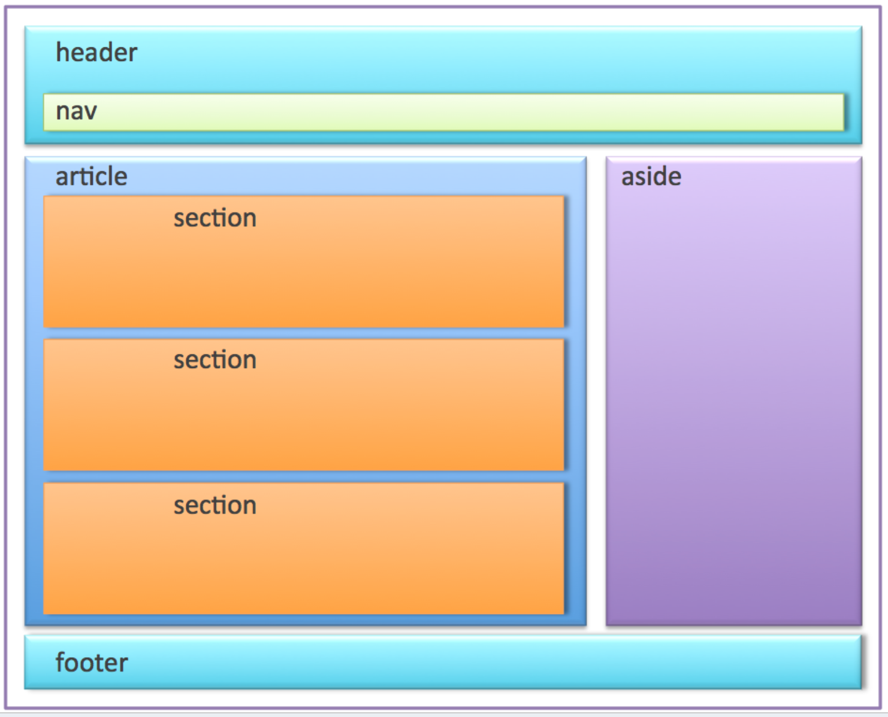
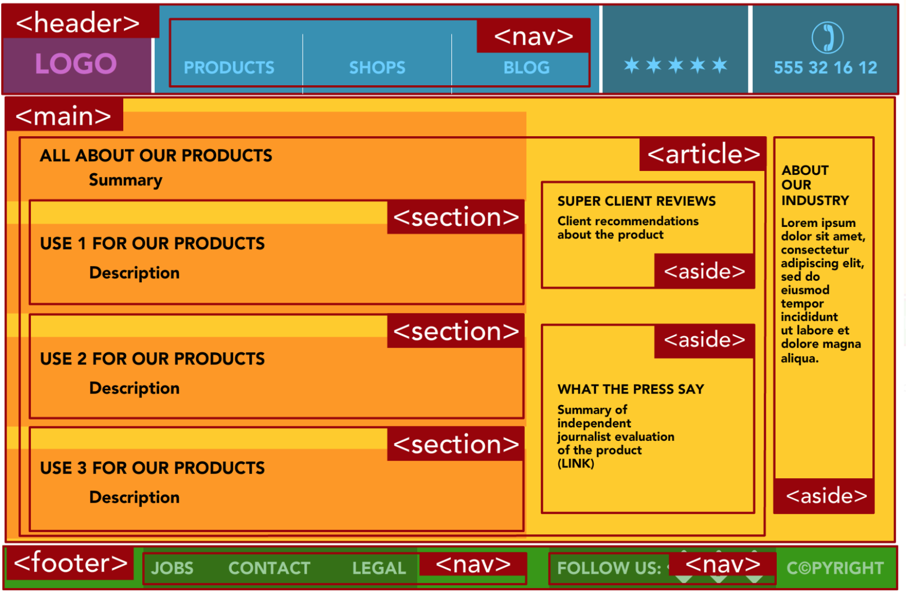
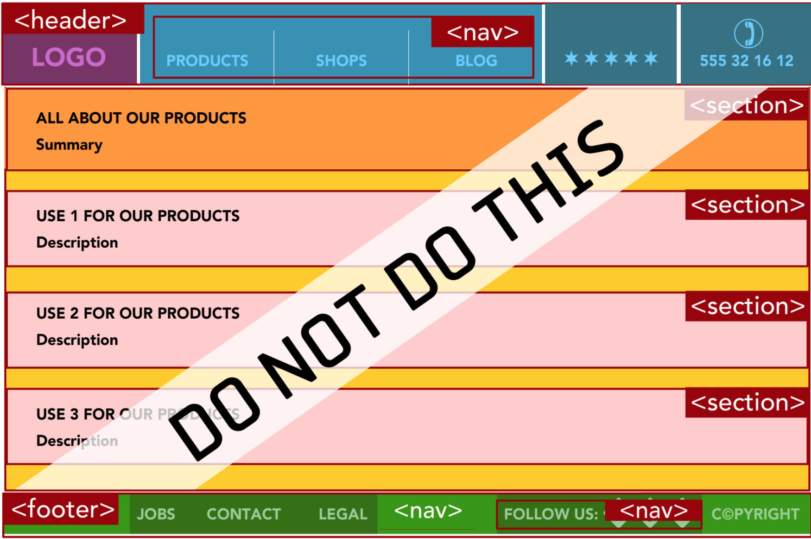

# HTML5 
- is the future, and it started like a rebel,
- which is **backed by WHATWG** (Web Hypertext Application Technology Working Group) which is a consortium of several companies like Opera, Mozilla, Apple, Google, Microsoft etc and it is confirmed as an HTML5 standard by **W3C**.
- W3C has been endorsing XHTML for a long while, but it is then abandoned in favor of promoting HTML5, which is continuously being evolved by WHATWG. So WHATWG develops and W3C approves it as official HTML5 standard.
- it supports all of HTML and XHTML too. So HTML5 is **fully backward compatible**.
- use **HTML5 validator** to make sure that your webpage is HTML5 compliant.
- tolerates
  - capitalization of tags
  - unclosed tags & single closed tags (`<br/>, <br />, <br>`)
  - if no quotes are put around attribute values like `` if there is no breaking symbols in value such as `> < = space` etc.
  - if attribute names comes without value like `<input type="checkbox" checked>`
  - _presentational elements_ such as `<center>, <font>, <strike>` etc are not welcome in HTML5
  - elements constitue 100 elements, where 30 are newly introduced, 10 are significantly improved.
  - you can use _modernizer_ to identify if your HTML5 feature is available in a client browser and act accordingly.
  - you can use _polyfills_ or _shims_ to simulate the missing HTML5 feature by some other means.
  - `modernizer` was used for HTML5 feature detection in your browser.

#### Doctype
- doctype of an HTML5 document is defined by `<!DOCTYPE html>`. 
  - By setting a doctype you are forcing all browsers (legacy ones and modern ones) to strictly follow the standard browser behavior for your html. So your html would look consistent across everywhere. If doctype is missing some older browsers may run on quirks mode, which may give undesirable effects on font size, layout etc.

#### Character encoding
- if you do not specify a character encoding, browser will assume something. It is always safe to instruct what character encoding does your file stands for. 
- You can specify this in HTML5 using `<meta charset="utf-8">`. 
- When you save the file, choose utf-8 as character encoding for that file.
- You should always put the character encoding in the first 512 bytes of HTML file. So I recomment to put charset as first meta tag.
```html
<!DOCTYPE html>
<html lang="en">
<head>
<meta charset="utf-8">
</head>
```

#### Language
- It is good to specify natural language of your web page by specifying `lang` attribute of html element as `<html lang="en">`. This helps search engines and screen readers to understand language of your file. In case if you have a different language in some section of your page, then enclose that element using `lang` attribute. For eg: `<div lang="ml">` for a malayalam web page.

#### Add stylesheet
- As CSS is the only stylesheet language around, you don't need to specify type as text/css as in older HTML versions.
`<link href="style.css" rel="stylesheet">`

#### Add Javascript
- As javascript is the only scripting language of web, you don't need to explicitly mention that.
`<script src="index.js"> </script>`. The closing <script> tag is essential.

# HTML5 Semantic Elements
With the advent of HTML5, semantics of elements used to construct a web page gathered huge significance. HTML5 introduced semantical tags for good **page structure** as well as tags to signify **text information**.

## Semantic elements for page structuring
`<div>` was the only element which took role of every container before HTML5. With HTML5 there are semantic elements which would help screen readers, search bots, accessibility tools to figure out nature of content in each container such as : `<article>`,`<header>`,`<footer>`,`<time>` etc

|Semantical page structure|
|------|
|An example of a good page structure|
| |
|A detailed sample of a good page structure|
| |
|A detailed sample of a bad page structure|
| |

Some of the new HTML5 semantic elements are:
- `<figure>`
  - `<figcaption>`
- `<aside>`
- `<nav>`
- `<main>` is the whole wrapper for content. Can have only one main. articles comes inside `<main>`
- `<section>` is preferrable for a block content that starts with a title
- `<details>`
  - `<summary>`

## Semantic elements for text information
- `<time>`
```html
The party starts at <time datetime="2019-06-14 16:00-05:30">June 14<sup>th</sup> 4:00 PM</time>
This page is published on <time pubdate datetime="2019-06-01 10:00-05:30">June 1<sup>st</sup></time>
```
- `<output>`
- `<mark>`
## Semantics obtained from standards other than HMLT5
1. ARIA
2. RDFa
3. Microformat
4. Microdata

### 1. ARIA - Accessibility Rich Internet Applications
ARIA introduced certain attributes to HTML elements to signify meaning of content to help screen readers understand the content.

_ARIA Attributes_

- `role`
- `aria-required` for mandatory fields. It serves the purpose similar to * put for visual cue.
- `aria-invalid`
### 2. RDFa - Resource Description Framework
This is a premature standard, which is taken over by newer standards such as Microdata.
### 3. Microformat
Microformat put meaning to your content by piggybacking on class attributes. You will add some reserved class names to inform screen readers what is the meaning of your content.
- `hCard` format uses class name `vcard`
  - `fn` for a person's full name
  - `url` for a person's home page
```html
<section>
  <h4>This is a section for Microformat</h4>
  <div class="vcard">
      <span class="fn">Full name</span>
      <a class="url" href="https://myhomepage.com"></a>
  </div>
</section>
```
- `hCalendar`
  - `vevent`
    - `summary` for description of event
    - `dtstart` for start date of event
    - `location` for location of event
```html
<div class="vevent">
  <h2 class="summary">Web Developer Clam Bake</h2>
  <p>I'm hosting a party!</p>
  <p>It's
  <span class="dtstart" title="2014-10-25 13:30">Tuesday, October 25,
  1:30PM</span>
  at the <span class="location">Deep Sea Hotel, San Francisco, CA
</span></p>
</div>
```
- There are formats other than `hCard` and `hCalendar` but peoples usage got limited to only these two.
### 4. Microdata
All possible microdata formats are catalogued in http://schema.org. And you add xml namespace of used microdata format so that screen readers can understand the underlying format by reading xml namespace. Thus, Microdata accessibility technique remains flexible as you can add any metadata into the xml namespace any time, hence it serve as living standard.

To begin a microdata section you would add `itemscope` and `itemtype` attributes to any HTML elements like:
```html
<div itemscope itemtype="http://schema.org/Person">
</div>
```
Then you add important bits of information by adding `itemprop` attributes like `itemprop="name"`
```html
<div itemscope itemtype="http://schema.org/Person">
    <h3 itemprop="name">Mike Rowe</h3>
    You can see Mike Rowe's website at <a itemprop="url" href="http://www.magicsemantics.com">www.magicsemantics.com</a>
</div>

```
# Web Storage
Web storage is a confusing term which means to store data in a user' computer. HTML5 gives tow kinds of web storage - **local storage** and **session storage**.
- **Cookies** can store only up to 4KB of data
- Once a cookie is set, that will be sent to server along with all future HTTP requests
- 5 MB of data can be saved using web storage
- both storage mechanisms store data using website domain name. So it doesn't work if you are loading web pages from disk.
- every values are stored in text form.
- any change to the storage in one browser window triggers an event `storage` to all other windows of same browser where this website is loaded. So it can be considered as a mechanism to update all windows of same browser via storage events. 

`document.addEventListener('storage','storageChangeHandler');`

This `storage` event is triggered when an existing data is changed or removed, or if storage is completely wipied off, or if new data is added.

The storageEvent object passed to `storage` event's handler looks like :

```javascript
StorageEvent {
    key;          // name of the property set, changed etc.
    oldValue;     // old value of property before change
    newValue;     // new value of property after change
    url;          // url of page that made the change
    storageArea;  // localStorage or sessionStorage,
                  // depending on where the change happened.
}
```

## 1. Cookies
Cookies are tiny bits of information stored on user's browser, generally used to track the user and user preferences. Two drawbacks of cookies are :
- They are very much limited in size 
- They are posted to server with every browser request


## 2. Local Storage
```javascript
localStorage.setItem('name','joji');
localStorage.getItem('name');
localStorage.removeItem(key);
localStorage.clear();
```

- To iterate through all keys in localstorage
```javsacript
if (localStorage) {
  let iterator = 0;
  let key = null;
  while ((key = localStorage.key(iterator)) !== null) {
    console.log(localStorage.getItem(key));
    iterator++;
  }
}
```

- It is also possible to get an item from local storage by:
`localStorage.name` OR `localStorage['name']`

## 3. Session Storage
- `sessionStorage.getItem(key)`
- Session storage is similar to local storage, but session storage lasts only until browser window or tab is closed.
- Two open tabs with same URL **doesn't share** `sessionStorage`. But, iframe or popup windows coming from same window shares sessionStorage.

# File API
- The File API helps to read a file directly from hard drive and give the file data to Javascript code. Earlier it was only possible through file upload to pass data into web server and , then pass down to browser client. 
- The file obtained using File API to Javascript could parse the data and send data to server using XMLHttpRequest.
- It is not possible to create a file in hard drive or change a file. But, you may store the file in localstorage.
- With File API there are 3 strategies to read file.
  - file input
  - a hidden file input, presented with a beautiful button
  - drag and drop file upload
- File API works in tandem with FileReader to read file contents
- HTML5 file operation deals with the following objects.
  - FileList
  - File
  - Blob
  - FileReader

```html
<!DOCTYPE html>
<html lang="en">

<head>
    <title>HTML5 File Upload</title>
    <meta charset="utf-8">
    <script src="js/main.js" type="module"></script>
</head>

<body>
    <main>
        <section>
            <h4>Upload your file</h4>
            <input type="file" name="fileinput" multiple>
        </section>
    </main>
</body>

</html> 
```

```js
// main.js

import fileUploadHandler from './file-upload.js';

window.onload = function onload() {
  const fileInput = document.getElementsByName('fileinput');
  fileInput[0].addEventListener('change', fileUploadHandler);
};
```

```js 
// file-upload.js

function fileUploadHandler(ev) {
  const { files } = ev.target;
  Object.values(files).forEach(file => {
    console.log(' 👍 Contents of file', file.name);
    const fr = new FileReader();
    fr.onload = loadedEvent => {
      let node;
      switch (file.type) {
        case 'image/jpeg':
          const imageSrc = loadedEvent.target.result;
          node = document.createElement('img');
          node.setAttribute('src', imageSrc);
          document.body.appendChild(node);
          break;
        case 'text/csv':
          const data = loadedEvent.target.result;
          node = document.createElement('span');
          node.textContent = data;
          document.body.appendChild(node);
      }
    };
    switch (file.type) {
      case 'image/jpeg':
        fr.readAsDataURL(file);
      case 'text/csv':
        fr.readAsText(file);
    }
  });
}
export default fileUploadHandler;
```
# Drag & Drop
- set attribute `draggable="true"` to any html5 tag to make it draggable
- add event listeners to draggable elements
  - `dragstart` - when dragged elemnt starts moving 
  - `dragend` - when dragged elment is dropped either inside or outside drop target
- add event listeners to drop target element
  - `dragenter` - when dragged element enters drop target
  - `dragleave` when dragged element leaves drop target boundary
  - `dragover` while dragged element is hovered over drop target
  - `drop` - when dragged element is dropped inside drop target
- Set data to be attached when an element is dragged
  - `event.dataTransfer.setData('text/plain', 'my data'); // (mime, data)`
- Get data configured on dragged element when that element is dropped
  - `event.dataTransfer.getData('text/plain');`


```javascript
// Code sample 

const draggableElements = document.querySelectorAll('#draggableItemsSection img');
const dropTarget = document.querySelector('#droppableSection');

draggableElements.forEach(img => {
  img.addEventListener('dragstart', ev => {
    ev.dataTransfer.setData('text/plain', ev.target.id);
  });
});

dropTarget.addEventListener('dragenter', ev => {
  this.stopDefaultBehavior(ev);
});
dropTarget.addEventListener('dragover', ev => {
  this.stopDefaultBehavior(ev);
});
dropTarget.addEventListener('drop', ev => {
  const draggedElementId = ev.dataTransfer.getData('text/plain');
  console.log(' ⚡️', draggedElementId);
  dropTarget.appendChild(document.getElementById(draggedElementId));
  this.stopDefaultBehavior(ev);
});

stopDefaultBehavior(ev) {
  ev.stopImmediatePropagation();
  ev.preventDefault();
}
```
# History API
- HTML5 introduced `window.history` API which let's JavaScript to access the history of pages visited on a browser under same website domain.
- It doesn't allow you to access history of other website domains.
- `history` object has the following methods
  - `history.back()`
  - `history.forward()`
  - `history.go(index)`
    - positive index calls forward() function _index_ number of times
    - negative index calls back() function _index_ number of times
  - `history.pushState(stateObject, title, URL)` - adds URL to the top of history stack
  - `history.replaceState(stateObject, title, URL)` - replaces current element in history with the new URL
- history change fires `popstate` event. This is fired only when either a `back()` or `forward()` or `go()` is called. When `pushState()` or `replaceState()` happens, this event is not fired.
- When `back()` or `forward()` or `go()` is called, the location.href value (address bar URL) is updated but actual content for that URL is not loaded. So, you will have to call content via AJAX by listening to `popstate` event.
